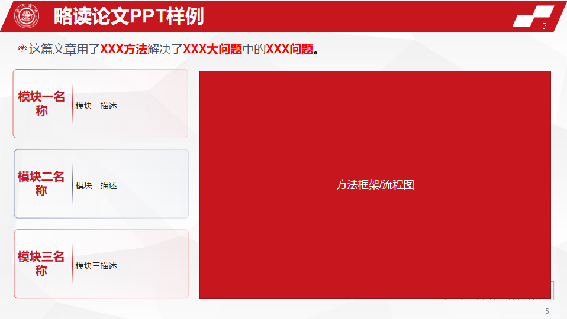

## 略读论文笔记

### 一段话

这篇文章用了XXX方法解决了XXX大问题中的XXX问题

- 样例：这篇文章用知识蒸馏的方法解决了联邦学习通信效率中的模型参数通信量大的问题。

### 一页PPT

一段话+一个总体框架图+各模块的简介，参考[略读论文PPT样例](./略读论文PPT.pptx)。

### 一个表格

对略读论文中的所有模块进行介绍、归类和对比

| 论文题目 | 论文链接 | 模块名称 | 模块描述                                            | 模块类型 | 模块评价             |
| -------- | -------- | -------- | --------------------------------------------------- | -------- | -------------------- |
| XXX      | XXX      | XXX      | 本模块通过XXX方法，解决了XXX的问题，实现了XXX的效果 | XXX领域  | 可复现/可集成/可修改 |
|          |          |          |                                                     |          |                      |

## 精读论文笔记

### 一个摘要

这个和文章本身的摘要不同，需要从多个维度对文章进行全面的概括，详细的笔记模板在后面提供了；

### 一个ppt

10-15min的，对文章内容进行全面的描述，并且需要能够在ppt后对可能被问到的问题进行整理，并且能够流畅的介绍这篇论文，并且能够正确快速的回答针对这篇文章的每一个问题。

### 一套代码

可以后续展开研究复现的，可能是可运行的源代码，可能是一个可以实现的代码实现方案，主要就是告诉老师和学长，这个论文是可以通过一定时间来进行复现的。